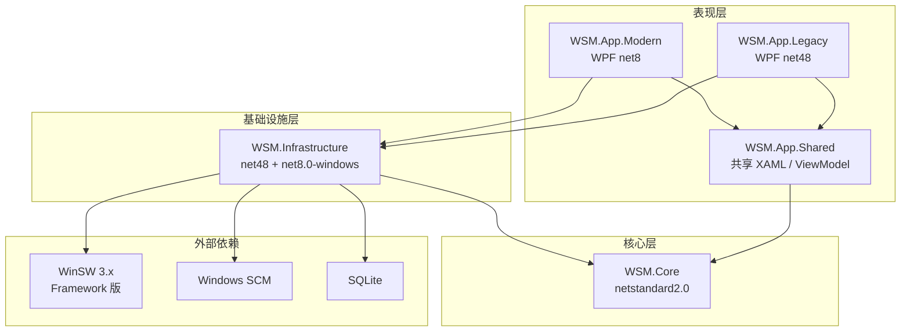
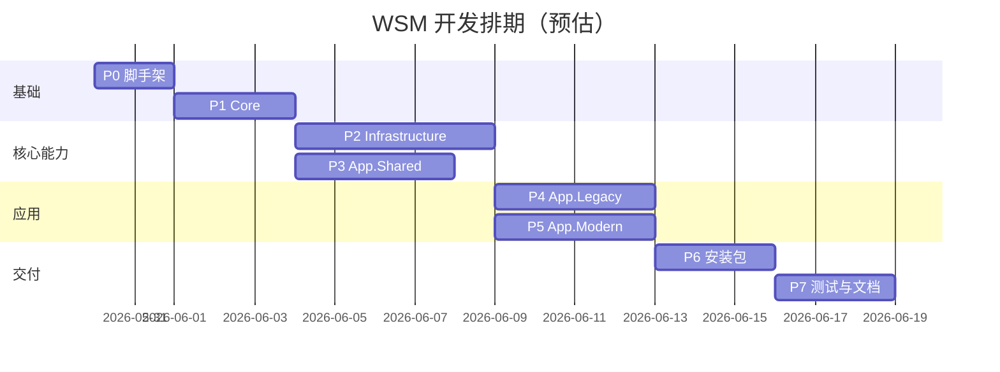

# WSM 实现步骤文档

> **Windows Service Manager** — 基于 WinSW 的 Windows 服务管理工具  
> 对标 Servy，支持将普通可执行程序注册为 Windows 服务  
> 架构模式：**模式 A（双应用 + 共享核心库）**

---

## 文档信息

| 项 | 内容 |
|----|------|
| 版本 | v0.3 |
| 状态 | 已确认（待开发） |
| 目标系统 | Windows 7 SP1 ~ Windows 10（Modern 版延伸至 Win11） |
| 底层引擎 | WinSW 3.x（.NET Framework 构建） |

---

## 一、产品概述

### 1.1 产品定位

WSM 是一款桌面端 Windows 服务管理工具，通过 WinSW 将普通程序包装为 Windows 服务，并提供统一的图形化管理界面。

### 1.2 核心功能

| 优先级 | 功能 | 说明 |
|:------:|------|------|
| P0 | 进程守护 | 崩溃自动重启、状态监控、失败策略配置 |
| P0 | 服务配置与添加 | 按程序路径向导式配置 ID/名称/描述/启动/重启等并注册服务 |
| P0 | 一键管理 | 安装/卸载/启停/重启/批量操作/刷新配置、编辑已有服务配置 |
| P0 | 日志查询 | 全服务混合日志、单服务日志、分级别筛选、实时 Tail |
| P1 | 指标监控 | CPU/内存/运行时长（可选，Modern 版优先） |
| P2 | 追踪 | 日志 TraceId 关联 / OpenTelemetry（可选，仅 Modern 版） |

### 1.3 版本划分

| 版本 | 目标框架 | 目标系统 | 说明 |
|------|----------|----------|------|
| **WSM Legacy** | .NET Framework 4.8 + WPF | Win7 SP1 / Win8 / 8.1 | 基础功能全集；安装包 **仅 x64** |
| **WSM Modern** | .NET 8 + WPF | Win10 1607+ / Win11 | 全功能 + 指标；安装包 **x64 自包含** |

---

## 二、架构设计（模式 A）

### 2.1 解决方案结构

```
pro_wsm/
├── WSM.sln
├── src/
│   ├── WSM.Core/                      # 共享核心（netstandard2.0）
│   ├── WSM.Infrastructure/          # 基础设施（net48 + net8.0-windows）
│   ├── WSM.App.Shared/                # 共享 UI 资源（可选，见 2.3）
│   ├── WSM.App.Legacy/                # Legacy 应用（net48 WPF）
│   └── WSM.App.Modern/                # Modern 应用（net8.0-windows WPF）
├── assets/
│   └── winsw/
│       ├── WinSW-x64.exe              # Framework 版
│       └── WinSW-x86.exe
├── installer/
│   ├── WSM.Installer.Legacy/          # WiX：Legacy x64 安装包
│   └── WSM.Installer.Modern/          # WiX：Modern x64 安装包
├── tests/
│   ├── WSM.Core.Tests/
│   └── WSM.Infrastructure.Tests/
└── docs/
    └── IMPLEMENTATION.md              # 本文档
```

### 2.2 架构图



### 2.3 共享 UI 策略

采用 **WSM.App.Shared** 类库项目，通过以下方式复用：

| 内容 | 共享方式 |
|------|----------|
| ViewModel | 放入 `WSM.App.Shared`（netstandard2.0 或双目标） |
| XAML 视图 | 链接文件（`<Link>`）或放入 Shared 的 WPF 类库 |
| 转换器 / 行为 | 放入 Shared |
| 主题 / 样式 | 放入 Shared |
| Legacy 独有 | 留在 `WSM.App.Legacy`（如 Win7 降级提示） |
| Modern 独有 | 留在 `WSM.App.Modern`（指标图表、追踪页） |

### 2.4 部署目录

```
%ProgramData%\WSM\
├── winsw\
│   ├── WinSW-x64.exe
│   └── WinSW-x86.exe
├── services\
│   └── {serviceId}\
│       ├── {serviceId}.exe       # 重命名的 WinSW 副本
│       ├── {serviceId}.xml       # WinSW 配置
│       └── logs\
│           ├── {serviceId}.out.log
│           ├── {serviceId}.err.log
│           └── {serviceId}.wrapper.log
└── data\
    └── wsm.db                    # SQLite（服务元数据 + 日志索引）
```

### 2.5 依赖清单

| 包 | 用途 | 目标 |
|----|------|------|
| CommunityToolkit.Mvvm | MVVM | Shared / App |
| Microsoft.Extensions.DependencyInjection | 依赖注入 | Infrastructure / App |
| Microsoft.Extensions.Hosting | 后台 Worker | Infrastructure / App |
| System.Data.SQLite 或 Microsoft.Data.Sqlite | 本地数据库 | Infrastructure |
| MaterialDesignThemes + MaterialDesignColors | Material Design 3 UI | App.Shared / App |
| MaterialDesignThemes.MahApps（可选） | 与 MahApps 集成辅助 | App.Shared |
| OxyPlot.Wpf 或 LiveCharts2 | 图表（Modern） | App.Modern |
| Serilog（可选） | 应用自身日志 | Infrastructure |

### 2.6 UI 框架与交互规范

#### 2.6.1 UI 框架选型

采用 **[Material Design In XAML Toolkit](https://github.com/MaterialDesignInXAML/MaterialDesignInXamlToolkit)**（Google Material Design 风格），Legacy / Modern 统一视觉。

| 项 | 选型 |
|----|------|
| 主题库 | `MaterialDesignThemes` + `MaterialDesignColors` |
| 设计规范 | **Material Design 3**（`MaterialDesign3.Defaults.xaml`） |
| 图标 | Material Design Icons（`PackIcon`） |
| 布局 | 左侧 `DrawerHost` 导航抽屉 + 右侧内容区 |
| 卡片 | `Card` 包裹服务列表项、配置分组 |
| 表单 | `TextBox` / `ComboBox` 使用 Material 样式 + 浮动标签（`HintAssist`） |

**NuGet 引用示例：**

```xml
<PackageReference Include="MaterialDesignThemes" Version="5.*" />
<PackageReference Include="MaterialDesignColors" Version="5.*" />
```

**App.xaml 主题配置示例：**

```xml
<materialDesign:BundledTheme BaseTheme="Light" PrimaryColor="Blue" SecondaryColor="Teal" />
<ResourceDictionary Source="pack://application:,,,/MaterialDesignThemes.Wpf;component/Themes/MaterialDesign3.Defaults.xaml" />
```

> Win7（Legacy）与 Win10+（Modern）使用同一套 Material 主题资源，保证视觉一致。

#### 2.6.2 消息提示规范（冒泡式，禁止弹框）

**强制约束：禁止使用 `MessageBox` 及模态 `ContentDialog` 作为操作反馈。**

所有操作结果、错误、警告均通过 **非模态冒泡提示** 展示，不阻断用户操作。

| 场景 | 组件 | 行为 |
|------|------|------|
| 操作成功 | `Snackbar`（成功色） | 底部滑入，3~4 秒自动消失，如「服务已启动」 |
| 操作失败 | `Snackbar`（错误色） | 底部滑入，5~6 秒，可带「重试」动作按钮 |
| 警告提示 | `Snackbar`（警告色） | 如「需要管理员权限」 |
| 后台事件 | `Snackbar` 或托盘气泡 | 守护检测到服务异常时提示 |
| 字段校验错误 | 表单项内联 `ValidationError` | 输入框下方红色提示，不用弹框 |
| 危险操作确认 | `DialogHost` 底部 Sheet / 行内展开 | 卸载服务等需二次确认时，使用 Material 内联面板，**非**系统模态框 |

**实现要点：**

- 在 `MainWindow` 根节点放置全局 `SnackbarMessageQueue`（Material Design 内置）
- ViewModel 通过 `ISnackbarService` 接口触发提示，与 UI 解耦
- 多条消息排队显示，避免重叠遮挡

```csharp
// 示例：ViewModel 中触发冒泡提示（禁止 MessageBox.Show）
_snackbarService.ShowSuccess("服务「{0}」已成功启动", serviceName);
_snackbarService.ShowError("安装失败：{0}", errorMessage);
```

#### 2.6.3 禁止使用项

| 禁止 | 替代 |
|------|------|
| `MessageBox.Show` | `ISnackbarService` |
| `System.Windows.MessageBox` | Snackbar |
| WinForms `MessageBox` | Snackbar |
| 模态 `Window` 弹错误 | Snackbar + 内联校验 |
| 原生 `OpenFileDialog` 无样式 | `OpenFileDialog` 可保留（系统对话框），但结果反馈走 Snackbar |

---

## 三、项目清单与职责

> 以下每个「开发项目」可独立排期、验收。请逐项确认。

---

### 项目 P0：解决方案脚手架

| 项 | 内容 |
|----|------|
| **编号** | P0 |
| **名称** | 解决方案脚手架 |
| **工期** | 1 ~ 2 天 |
| **依赖** | 无 |
| **产出** | 可编译的解决方案骨架、目录结构、CI 基础配置 |

**任务清单：**

- [ ] 创建 `WSM.sln` 及五个项目（Core / Infrastructure / App.Shared / App.Legacy / App.Modern）
- [ ] 配置项目引用关系与目标框架
- [ ] 引入 NuGet 依赖（见 2.5）
- [ ] 配置 `Directory.Build.props`（统一版本号、语言版本、nullable 等）
- [ ] 嵌入 WinSW 资源（x64 Framework 版；另备 x86 供托管 32 位目标程序时使用）
- [ ] 添加 `.editorconfig`、`.gitignore`
- [ ] 验证 Legacy / Modern 均可编译启动空白窗口

**验收标准：**

- `dotnet build` / VS 编译通过
- Legacy 在 net48 下启动空白 WPF 窗口
- Modern 在 net8.0-windows 下启动空白 WPF 窗口

---

### 项目 P1：WSM.Core 核心领域层

| 项 | 内容 |
|----|------|
| **编号** | P1 |
| **名称** | WSM.Core 核心领域层 |
| **工期** | 2 ~ 3 天 |
| **依赖** | P0 |
| **产出** | 领域模型、接口定义、纯逻辑组件 |

**任务清单：**

- [ ] **模型** `ManagedService`：完整字段见 §4.4（ID、名称、描述、路径、参数、工作目录、环境变量、启动模式、依赖、停止超时、失败策略、日志策略）
- [ ] **模型** `ServiceStatus`：未安装 / 已停止 / 运行中 / 启动中 / 停止中 / 异常
- [ ] **模型** `FailurePolicy`：重启次数、延迟、重置窗口
- [ ] **模型** `EnvVariable`、`LogPolicy`
- [ ] **模型** `LogEntry`：时间戳、服务 ID、级别、来源（stdout/stderr/wrapper）、原文、文件偏移
- [ ] **模型** `LogFilter` / `LogQuery`：服务 ID、级别、关键词、时间范围
- [ ] **模型** `OperationResult`：成功/失败、消息、异常
- [ ] **接口** `IWinSwConfigGenerator`：模型 → WinSW XML
- [ ] **接口** `IWinSwHostService`：install / uninstall / start / stop / restart / status / refresh
- [ ] **接口** `IServiceRepository`：服务 CRUD
- [ ] **接口** `ILogAggregator`：混合/单服务日志查询与 Tail
- [ ] **接口** `ILogParser`：日志级别解析
- [ ] **接口** `IServiceWatchdog`：守护监控
- [ ] **接口** `IProcessMonitor`：CPU/内存（Modern 可选实现）
- [ ] **实现** `ServiceConfigValidator`：ID 格式、唯一性、路径存在性、必填校验
- [ ] **实现** `WinSwXmlGenerator`：生成 WinSW XML 配置（覆盖 §4.2 全部字段）
- [ ] **实现** `LogLevelParser`：Wrapper 日志 + 常见应用日志格式正则
- [ ] **实现** `ServiceIdSuggester`：根据 exe 文件名建议服务 ID

- [ ] **实现** `OsVersionHelper`：OS 版本检测、.NET 4.8 检测

**验收标准：**

- 单元测试：`ServiceConfigValidator` 覆盖 ID 格式、重名、路径校验
- 单元测试：`WinSwXmlGenerator` 输出符合 WinSW 3.x 规范，含 onfailure / log / startmode
- 单元测试：`LogLevelParser` 正确解析 INFO/WARN/ERROR/FATAL 及常见格式
- 无 UI / 无 IO 依赖（纯逻辑）

---

### 项目 P2：WSM.Infrastructure 基础设施层

| 项 | 内容 |
|----|------|
| **编号** | P2 |
| **名称** | WSM.Infrastructure 基础设施层 |
| **工期** | 4 ~ 5 天 |
| **依赖** | P1 |
| **产出** | WinSW 集成、SCM 操作、SQLite 持久化、日志采集 |

**任务清单：**

- [ ] **WinSwCliExecutor**：封装子进程调用 WinSW CLI，解析 stdout 状态输出
- [ ] **WinSwHostService**：实现 `IWinSwHostService`（部署 WinSW 副本、生成 XML、执行命令）
- [ ] **WindowsScmService**：`ServiceController` 封装，查询状态/启动类型/依赖
- [ ] **SqliteServiceRepository**：实现 `IServiceRepository`，SQLite 建表与 CRUD
- [ ] **LogFileDiscovery**：按 WinSW 命名规则发现日志文件
- [ ] **LogTailService**：`FileStream` 增量读取 + `FileSystemWatcher` + 轮询兜底
- [ ] **LogAggregator**：实现 `ILogAggregator`，混合日志按时间排序
- [ ] **LogIndexRepository**：日志写入 SQLite 索引（时间戳、级别、偏移量）
- [ ] **ServiceWatchdogWorker**：后台定时检测服务状态，异常时记录/可选自动重启
- [ ] **ProcessMonitorService**（Modern 条件编译）：CPU/内存采样
- [ ] **DependencyInjectionExtensions**：`AddWsmInfrastructure()` 注册全部服务
- [ ] **路径管理** `WsmPaths`：统一管理 `%ProgramData%\WSM` 目录

**验收标准：**

- 集成测试：对测试用 exe 完成 install → start → status → stop → uninstall 全流程
- 日志 Tail 能实时捕获新写入行
- SQLite 正确持久化服务定义

---

### 项目 P3：WSM.App.Shared 共享 UI 层

| 项 | 内容 |
|----|------|
| **编号** | P3 |
| **名称** | WSM.App.Shared 共享 UI 层 |
| **工期** | 3 ~ 4 天 |
| **依赖** | P1 |
| **产出** | 共享 ViewModel、样式、通用视图、导航框架 |

**任务清单：**

- [ ] **Material Design 3 主题**：`BundledTheme`、MD3 Defaults、全局 Snackbar 队列
- [ ] **接口** `ISnackbarService`：ShowSuccess / ShowError / ShowWarning / ShowInfo（冒泡，禁止 MessageBox）
- [ ] **MainWindow 框架**：`DrawerHost` 左侧导航 + 右侧内容区
- [ ] **导航项**：服务总览、添加服务、日志中心、设置（Modern 额外：指标、追踪）
- [ ] **ViewModel** `MainViewModel`：导航、全局状态、注入 `ISnackbarService`
- [ ] **ViewModel** `ServiceListViewModel`：服务列表、筛选、批量选择
- [ ] **ViewModel** `ServiceDetailViewModel`：单服务详情、启停/重启/卸载操作
- [ ] **ViewModel** `ServiceInstallViewModel`：4 步配置向导状态机（§4.2 全部字段）
- [ ] **ViewModel** `ServiceEditViewModel`：编辑模式复用向导，保存后触发 refresh
- [ ] **ViewModel** `LogViewerViewModel`：日志列表、筛选、搜索、自动滚动
- [ ] **ViewModel** `SettingsViewModel`：通用设置
- [ ] **视图** `ServiceListView`：Material `Card` + 虚拟化列表，状态 Chip
- [ ] **视图** `ServiceInstallWizard`：Material Stepper 四步向导 + 确认摘要 Card
- [ ] **视图** `ServiceEditView`：复用向导，预填数据
- [ ] **视图** `LogViewerView`：日志查看器
- [ ] **组件** `SnackbarHost`：全局底部 Snackbar 宿主
- [ ] **组件** `ConfirmActionPanel`：危险操作（卸载）内联确认面板，非模态弹框
- [ ] **转换器**：状态 → 颜色/图标、级别 → 颜色
- [ ] **权限检测** `AdminPrivilegeHelper`：检测/请求管理员权限，结果走 Snackbar

**验收标准：**

- ViewModel 可独立于 App 进行单元测试（mock 接口）
- 配置向导 4 步可完成全流程，字段与 §4.2 一致
- 所有操作反馈通过 Snackbar，代码中无 `MessageBox` 调用
- Legacy / Modern 均可引用并显示 Material 主界面

---

### 项目 P4：WSM.App.Legacy Legacy 应用

| 项 | 内容 |
|----|------|
| **编号** | P4 |
| **名称** | WSM.App.Legacy |
| **工期** | 3 ~ 4 天 |
| **依赖** | P2, P3 |
| **产出** | 可在 Win7 SP1 ~ Win8.1 运行的完整应用 |

**任务清单：**

- [ ] **App.xaml.cs**：DI 容器初始化、`AddWsmInfrastructure()` 注册
- [ ] **启动检测**：.NET Framework 4.8、管理员权限、d3dcompiler_47（KB4019990）
- [ ] **系统托盘**：`NotifyIcon` 快速启停、退出
- [ ] **服务总览页**：接入 `ServiceListViewModel`，启停/重启/卸载，操作结果 Snackbar 提示
- [ ] **添加服务向导**：完整 4 步流程（§4.2），安装后 Snackbar 反馈
- [ ] **编辑服务配置**：`ServiceEditViewModel`，保存后 refresh + Snackbar
- [ ] **日志中心**：混合/单服务/分级别三个 Tab
- [ ] **批量操作**：全选、批量启动、批量停止
- [ ] **守护配置 UI**：失败重启策略编辑（集成在向导步骤 4）
- [ ] **Win7 降级处理**：PerformanceCounter 不可用时隐藏指标相关 UI
- [ ] **关于页面**：版本信息、系统兼容性说明
- [ ] **禁止 MessageBox**：代码审查 / 分析器规则确保仅用 Snackbar

**验收标准：**

- Win7 SP1 x64 虚拟机：安装服务 → 启动 → 查看日志 → 停止 → 卸载
- 无 .NET 4.8 时通过 Snackbar + 内联引导提示安装（非弹框）

---

### 项目 P5：WSM.App.Modern Modern 应用

| 项 | 内容 |
|----|------|
| **编号** | P5 |
| **名称** | WSM.App.Modern |
| **工期** | 3 ~ 4 天 |
| **依赖** | P2, P3 |
| **产出** | 可在 Win10+ 运行的增强版应用 |

**任务清单：**

- [ ] **App.xaml.cs**：DI 容器初始化（同 Legacy，注册 Modern 专属服务）
- [ ] **启动检测**：.NET 8 运行时（或自包含）、管理员权限
- [ ] **复用 Shared 全部 P0 功能**（服务管理、日志）
- [ ] **指标面板** `MetricsViewModel` + `MetricsView`：CPU/内存实时折线图
- [ ] **服务详情指标 Tab**：单服务性能图表
- [ ] **ProcessMonitorService** 完整实现（无降级）
- [ ] **追踪面板**（P2 可选）：日志 TraceId 高亮与关联跳转
- [ ] **自包含发布配置**：`PublishSingleFile` + `SelfContained`
- [ ] **服务异常 Snackbar**：守护检测到异常时底部冒泡提示（替代 Toast 弹框）

**验收标准：**

- Win10 x64：全功能流程通过
- 指标图表实时刷新（2s 采样）
- 自包含发布包可在无 .NET 8 预装的 Win10 上运行

---

### 项目 P6：安装包

| 项 | 内容 |
|----|------|
| **编号** | P6 |
| **名称** | 安装包工程 |
| **工期** | 2 ~ 3 天 |
| **依赖** | P4, P5 |
| **产出** | Legacy / Modern 两个独立 WiX 安装包（均 x64） |

**任务清单：**

- [ ] **WSM.Installer.Legacy**（WiX）：**仅 x64**，包含 WSM.App.Legacy + .NET 4.8 前置检测
- [ ] **WSM.Installer.Modern**（WiX）：**x64 自包含**，包含 WSM.App.Modern 发布产物
- [ ] **两个独立 MSI**：`WSM-Legacy-x64.msi`、`WSM-Modern-x64.msi`，用户按系统手动选择下载安装
  - Win7 SP1 / Win8 / 8.1 → 使用 **Legacy 包**
  - Win10 1607+ / Win11 → 使用 **Modern 包**
- [ ] **前置检测**（WiX LaunchCondition / 自定义 BA）：Legacy 需 .NET Framework 4.8；磁盘空间
- [ ] **快捷方式**：开始菜单、桌面（可选）
- [ ] **卸载程序**：保留/清理 `%ProgramData%\WSM` 选项
- [ ] **升级策略**：同版本 MSI 覆盖安装，保留 `wsm.db` 与服务配置
- [ ] **发布说明**：README 中注明两包适用系统，避免混装

**验收标准：**

- Win7 x64：Legacy MSI 安装/卸载成功
- Win10 x64：Modern MSI 安装/卸载成功
- 两包可同时存在于仓库，互不包含 OS 自动选择逻辑

---

### 项目 P7：测试与文档

| 项 | 内容 |
|----|------|
| **编号** | P7 |
| **名称** | 测试与文档 |
| **工期** | 2 ~ 3 天 |
| **依赖** | P4, P5, P6 |
| **产出** | 测试报告、用户手册 |

**任务清单：**

- [ ] **单元测试** WSM.Core.Tests：XML 生成、日志解析、模型验证
- [ ] **集成测试** WSM.Infrastructure.Tests：WinSW 全流程（需管理员）
- [ ] **测试矩阵执行**（见第六节）
- [ ] **用户手册**：安装、**添加服务（4 步向导）**、编辑配置、日志查看、常见问题
- [ ] **开发者文档**：架构说明、扩展接口、构建命令

**验收标准：**

- 核心单元测试覆盖率 > 80%（Core 层）
- 测试矩阵全部通过或记录已知限制

---

## 四、服务配置与添加（核心流程）

本节描述用户**添加 / 编辑托管服务**的完整操作流程，是产品最核心的交互路径。

### 4.1 入口

| 入口 | 说明 |
|------|------|
| 服务总览页「添加服务」按钮 | 新建服务，打开配置向导 |
| 服务列表右键「编辑配置」 | 修改已注册服务的配置并 `refresh` |
| 拖拽 exe 到主窗口（可选） | 自动填充可执行路径，进入向导 |

### 4.2 配置向导（分步 Material Stepper）

采用 Material Design **分步向导**（`materialDesign:ColorZone` + 步骤指示器），共 4 步：

```
步骤 1 选择程序 → 步骤 2 基本信息 → 步骤 3 运行与启动 → 步骤 4 守护与日志 → 确认安装
```

#### 步骤 1：选择程序

| 字段 | 类型 | 必填 | 说明 |
|------|------|:----:|------|
| 可执行文件路径 | 文件选择 | ✅ | 浏览选择 `.exe`；支持手动输入路径 |
| 工作目录 | 文件夹 | 推荐 | 默认取 exe 所在目录，可修改 |
| 启动参数 | 文本 | 否 | 传给目标程序的命令行参数 |
| 环境变量 | 键值列表 | 否 | 可添加多组 `name=value` |

**交互：**

- 选择 exe 后自动填充工作目录
- 路径不存在时表单项内联报错（非弹框）
- 根据文件名**建议**服务 ID（可编辑，见步骤 2）

#### 步骤 2：基本信息

| 字段 | 映射 WinSW XML | 必填 | 规则 |
|------|----------------|:----:|------|
| 服务 ID | `<id>` | ✅ | 全小写、字母数字连字符，唯一，如 `my-api` |
| 显示名称 | `<name>` | ✅ | Windows 服务管理器中显示的名称 |
| 描述 | `<description>` | 否 | 服务说明文字 |

**校验（内联提示，Snackbar 汇总）：**

- ID 不能与已有服务重复
- ID 符合 `^[a-z][a-z0-9-]*$` 格式
- 名称不能为空

#### 步骤 3：运行与启动

| 字段 | 映射 WinSW XML | 选项 | 默认值 |
|------|----------------|------|--------|
| 启动类型 | `<startmode>` | 自动 / 手动 / 禁用 | 自动 |
| 延迟自动启动 | `<delayedAutoStart>` | 是 / 否 | 是 |
| 服务依赖 | `<depend>` | 多选已安装服务 | 无 |
| 停止超时 | `<stoptimeout>` | 秒数 | 15 sec |
| 安装后立即启动 | — | 是 / 否 | 是 |

#### 步骤 4：守护与重启

| 字段 | 映射 WinSW XML | 说明 |
|------|----------------|------|
| 失败后动作 | `<onfailure action="...">` | 第 1 次：重启（延迟 5s） |
| | | 第 2 次：重启（延迟 10s） |
| | | 第 3 次：不操作 |
| 失败计数重置 | `<resetfailure>` | 默认 1 hour |
| 日志模式 | `<log mode="...">` | roll-by-size |
| 单文件大小上限 | `<sizeThreshold>` | 10240 KB |
| 保留文件数 | `<keepFiles>` | 10 |

**预设模板（下拉快速选择）：**

| 模板 | 说明 |
|------|------|
| 标准守护 | 2 次重启 + 1 小时重置（默认） |
| 积极守护 | 3 次重启，短延迟 |
| 仅监控 | 不自动重启，只记录日志 |

#### 步骤 5：确认与安装

- 以 **Card 摘要** 展示全部配置（只读预览）
- 提供「生成 XML 预览」折叠面板（高级用户）
- 点击「安装服务」：
  1. 生成 WinSW XML
  2. 部署 WinSW 副本
  3. 执行 `install`
  4. 可选 `start`
  5. Snackbar 提示结果：「服务 my-api 安装成功并已启动」

### 4.3 编辑已有服务

| 操作 | 流程 |
|------|------|
| 编辑配置 | 打开同一向导，预填当前值 → 保存 → `refresh`（无需重装） |
| 修改可执行路径 | 允许，保存后 `refresh` |
| 修改服务 ID | **不允许**（需卸载后重新添加） |

编辑保存成功：`Snackbar`「配置已更新，服务已刷新」。

### 4.4 配置数据模型（ManagedService 完整字段）

```csharp
public class ManagedService
{
    // 基本信息
    public string Id { get; set; }              // 服务 ID（唯一，创建后不可改）
    public string DisplayName { get; set; }     // 显示名称
    public string Description { get; set; }     // 描述

    // 程序路径
    public string ExecutablePath { get; set; }  // 可执行文件完整路径
    public string WorkingDirectory { get; set; }
    public string Arguments { get; set; }
    public List<EnvVariable> EnvironmentVariables { get; set; }

    // 启动
    public ServiceStartMode StartMode { get; set; }  // Automatic / Manual / Disabled
    public bool DelayedAutoStart { get; set; }
    public List<string> Dependencies { get; set; }
    public int StopTimeoutSeconds { get; set; }
    public bool StartAfterInstall { get; set; }

    // 守护
    public FailurePolicy FailurePolicy { get; set; }

    // 日志
    public LogPolicy LogPolicy { get; set; }

    // 元数据
    public DateTime CreatedAt { get; set; }
    public DateTime UpdatedAt { get; set; }
}
```

### 4.5 配置向导相关开发项目

以下任务分布在 P1 / P3 / P4 / P5 中，此处汇总便于验收：

| 任务 | 所属项目 | 说明 |
|------|----------|------|
| `ManagedService` 完整模型 | P1 | 含校验逻辑 |
| `ServiceConfigValidator` | P1 | ID 格式、路径存在性、重名检测 |
| `WinSwXmlGenerator` | P1 | 模型 → XML |
| `ServiceInstallViewModel` | P3 | 向导 4 步状态机、校验、安装命令 |
| `ServiceEditViewModel` | P3 | 编辑模式复用向导 |
| `ServiceInstallWizard.xaml` | P3 | Material Stepper 视图 |
| `ISnackbarService` | P3 | 冒泡提示服务 |
| `WinSwHostService.InstallAsync` | P2 | 执行安装流程 |
| `WinSwHostService.RefreshAsync` | P2 | 编辑后刷新 |

---

## 五、WinSW 集成规范

### 5.1 服务安装流程

```
用户填写配置
    ↓
WinSwXmlGenerator 生成 XML
    ↓
复制 WinSW.exe → %ProgramData%\WSM\services\{id}\{id}.exe
    ↓
写入 {id}.xml
    ↓
执行 {id}.exe install（管理员权限）
    ↓
写入 SQLite 服务记录
    ↓
（可选）执行 {id}.exe start
```

### 5.2 XML 配置模板

```xml
<service>
  <id>{serviceId}</id>
  <name>{displayName}</name>
  <description>{description}</description>
  <executable>{targetExe}</executable>
  <arguments>{arguments}</arguments>
  <workingdirectory>{workingDir}</workingdirectory>
  <startmode>{Automatic|Manual|Disabled}</startmode>
  <delayedAutoStart>true</delayedAutoStart>
  <log mode="roll-by-size">
    <sizeThreshold>10240</sizeThreshold>
    <keepFiles>10</keepFiles>
  </log>
  <onfailure action="restart" delay="5 sec"/>
  <onfailure action="restart" delay="10 sec"/>
  <onfailure action="none"/>
  <resetfailure>1 hour</resetfailure>
  <stoptimeout>15 sec</stoptimeout>
</service>
```

### 5.3 CLI 命令映射

| 用户操作 | WinSW 命令 |
|----------|------------|
| 安装 | `{id}.exe install` |
| 卸载 | `{id}.exe stop` → `{id}.exe uninstall` |
| 启动 | `{id}.exe start` |
| 停止 | `{id}.exe stop` |
| 重启 | `{id}.exe restart` |
| 查状态 | `{id}.exe status` |
| 刷新配置 | `{id}.exe refresh` |

---

## 六、日志系统设计

### 6.1 日志来源

| 文件 | 来源 | 默认级别 |
|------|------|----------|
| `{id}.wrapper.log` | WinSW 自身 | INFO / WARN / ERROR / FATAL |
| `{id}.out.log` | 应用 stdout | 正则解析 |
| `{id}.err.log` | 应用 stderr | Error |

### 6.2 三个视图

| 视图 | 数据源 | 排序 |
|------|--------|------|
| 全服务混合 | 所有服务的 wrapper + out + err | 按时间戳全局排序 |
| 单服务 | 指定 serviceId 的三个文件 | 按时间戳 |
| 分级别 | 上述 + LogFilter.Level | 按级别筛选 |

### 6.3 级别解析规则

```
优先级：
1. Wrapper 日志 → 直接读 "LEVEL" 字段
2. stdout → 匹配内置正则（可配置）：
   - \[INFO\], \[WARN\], \[ERROR\]
   - INFO |, WARN |, ERROR |
   - "level":"info"（JSON 行）
3. stderr → 默认 Error
4. 无法识别 → Debug / Unknown
```

---

## 七、测试矩阵

| 测试项 | Win7 SP1 x64 | Win10 x64 | Win11 x64 |
|--------|:------------:|:---------:|:---------:|
| Legacy MSI 安装（x64） | ✅ | — | — |
| Modern MSI 安装（x64） | — | ✅ | ✅ |
| 添加服务向导（4 步） | ✅ | ✅ | ✅ |
| 编辑服务配置 + refresh | ✅ | ✅ | ✅ |
| Snackbar 冒泡提示（无 MessageBox） | ✅ | ✅ | ✅ |
| 启停/重启 | ✅ | ✅ | ✅ |
| 崩溃自动重启 | ✅ | ✅ | ✅ |
| 日志 Tail | ✅ | ✅ | ✅ |
| 混合日志 | ✅ | ✅ | ✅ |
| 级别筛选 | ✅ | ✅ | ✅ |
| 批量操作 | ✅ | ✅ | ✅ |
| CPU/RAM 图表 | — | ✅ | ✅ |
| 托盘通知 | ✅ | ✅ | ✅ |
| 自包含运行（Modern） | — | ✅ | ✅ |

> **说明：** Legacy / Modern 安装包均仅提供 **x64**；不在 Win7 x86 上测试 WSM 本体。WinSW x86 仍随产品分发，用于在 x64 系统上托管 32 位目标程序。

---

## 八、实施排期



| 阶段 | 项目 | 工期 | 累计 |
|------|------|------|------|
| 第一阶段 | P0 + P1 | 3 ~ 5 天 | 3 ~ 5 天 |
| 第二阶段 | P2 + P3（可并行） | 4 ~ 5 天 | 7 ~ 10 天 |
| 第三阶段 | P4 + P5（可并行） | 3 ~ 4 天 | 10 ~ 14 天 |
| 第四阶段 | P6 + P7 | 4 ~ 6 天 | 14 ~ 20 天 |

**总工期预估：3 ~ 4 周**

---

## 九、待确认事项

### 已确认决策（v0.3）

| 项 | 决策 |
|----|------|
| Legacy x86 安装包 | **不提供**，仅 x64 |
| Modern 安装包 | x64，自包含 .NET 8 |
| 安装包工具 | **WiX Toolset** |
| 分发方式 | **两个独立 MSI**，用户按系统选择，无自动 OS 检测安装器 |
| 数据目录 | `%ProgramData%\WSM` |

---

请对剩余项确认或回复修改意见：

### 9.1 架构确认

- [x] **模式 A**：双应用（Legacy + Modern）+ 共享 Core/Infrastructure/Shared
- [x] **UI 框架**：WPF + **Material Design In XAML Toolkit（MD3）**
- [x] **消息提示**：**Snackbar 冒泡式**，禁止 MessageBox 弹框
- [ ] **共享策略**：ViewModel + XAML 放入 `WSM.App.Shared`

### 9.2 平台确认

- [x] **Legacy 目标**：.NET Framework 4.8，支持 Win7 SP1 / Win8 / 8.1
- [x] **Modern 目标**：.NET 8 自包含，支持 Win10 1607+ / Win11
- [x] **Legacy 提供 x86 包**：**否**（仅 x64）
- [x] **Modern 仅 x64**：**是**

### 9.3 功能范围确认

- [ ] **MVP（第一版）**：P0 ~ P6，指标/追踪仅 Modern
- [ ] **追踪（P2）**：第一版不做，后续迭代
- [ ] **健康检查探针**：第一版不做，后续迭代
- [ ] **配置导入/导出**：第一版不做，后续迭代

### 9.4 安装确认

- [x] **安装包工具**：**WiX Toolset**
- [x] **分发方式**：**两个独立安装包**（`WSM-Legacy-x64.msi` + `WSM-Modern-x64.msi`），无统一 OS 检测安装器
- [x] **数据目录**：`%ProgramData%\WSM`

### 9.5 UI 确认

- [x] **皮肤**：Material Design 3（Primary: Blue, Secondary: Teal，可调整）
- [x] **消息**：Snackbar 冒泡，禁止弹框
- [x] **服务配置**：4 步向导（选程序 → 基本信息 → 启动 → 守护日志）
- [ ] **语言**：第一版仅中文

---

## 十、项目编号速查

| 编号 | 名称 | 类型 | 目标框架 |
|:----:|------|------|----------|
| P0 | 解决方案脚手架 | 工程 | — |
| P1 | WSM.Core | 类库 | netstandard2.0 |
| P2 | WSM.Infrastructure | 类库 | net48 + net8.0-windows |
| P3 | WSM.App.Shared | 类库 | netstandard2.0 + WPF 共享 |
| P4 | WSM.App.Legacy | 应用 | net48 |
| P5 | WSM.App.Modern | 应用 | net8.0-windows |
| P6 | 安装包（WiX ×2） | 安装工程 | — |
| P7 | 测试与文档 | 测试/文档 | — |

---

## 十一、修订记录

| 版本 | 日期 | 说明 |
|------|------|------|
| v0.3 | 2026-05-29 | 确认：Legacy 仅 x64；安装包 WiX；两个独立 MSI |
| v0.2 | 2026-05-29 | 新增第四章「服务配置与添加」；UI 改为 Material Design 3；明确 Snackbar 冒泡提示规范 |
| v0.1 | 2026-05-29 | 初稿：模式 A 架构，8 个开发项目划分 |
